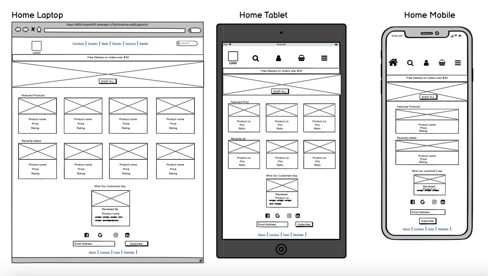
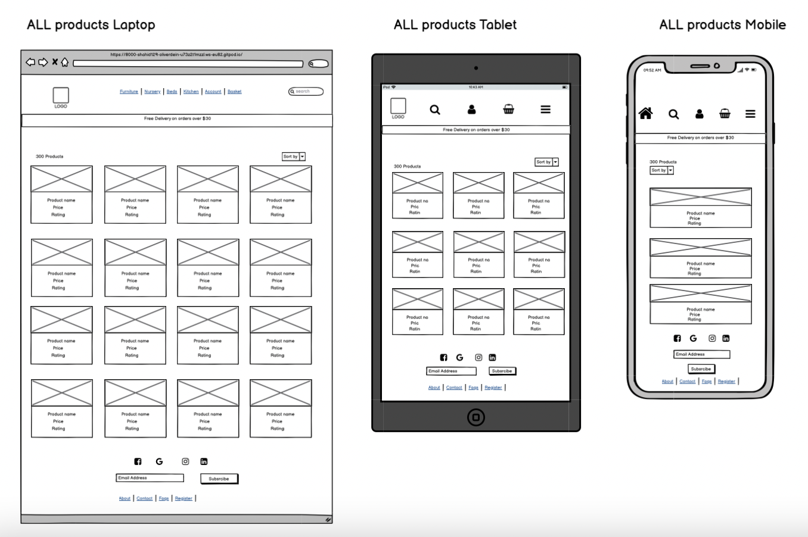
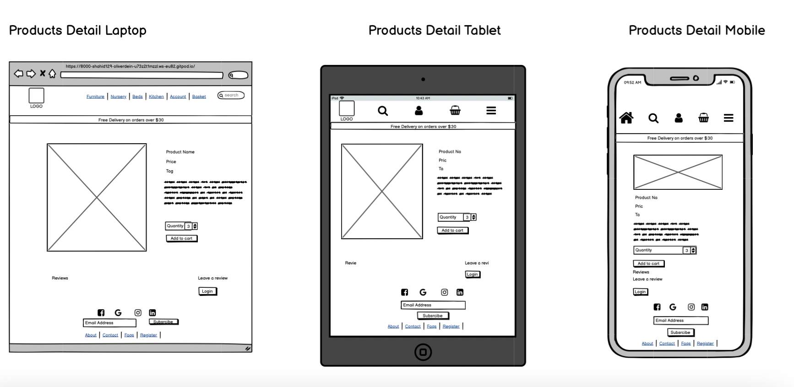
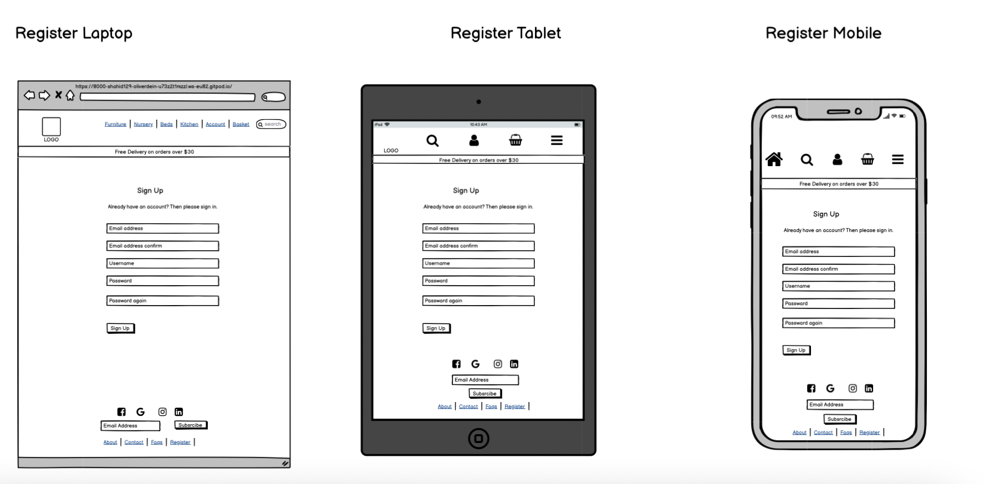
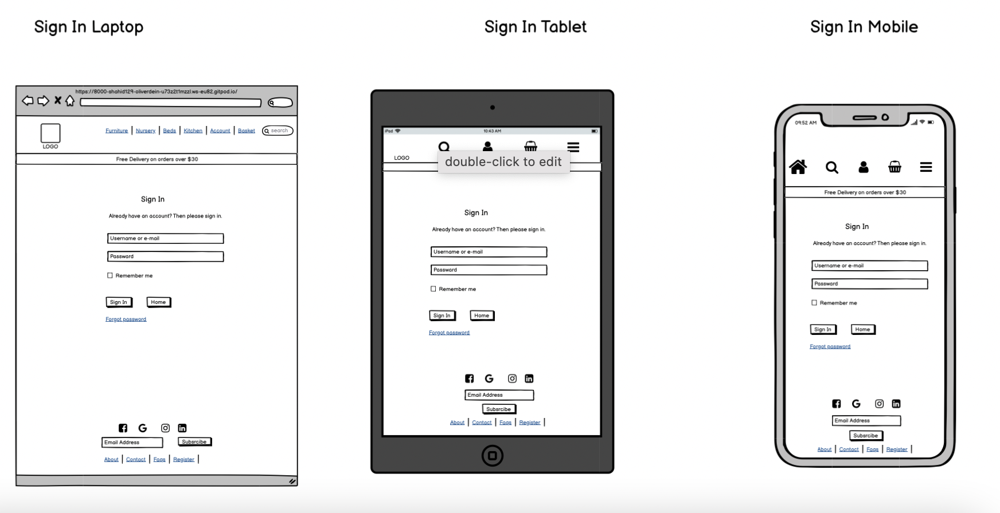
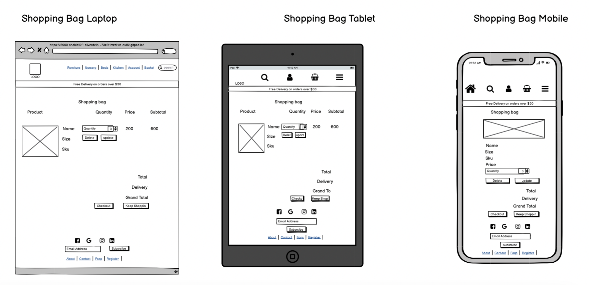
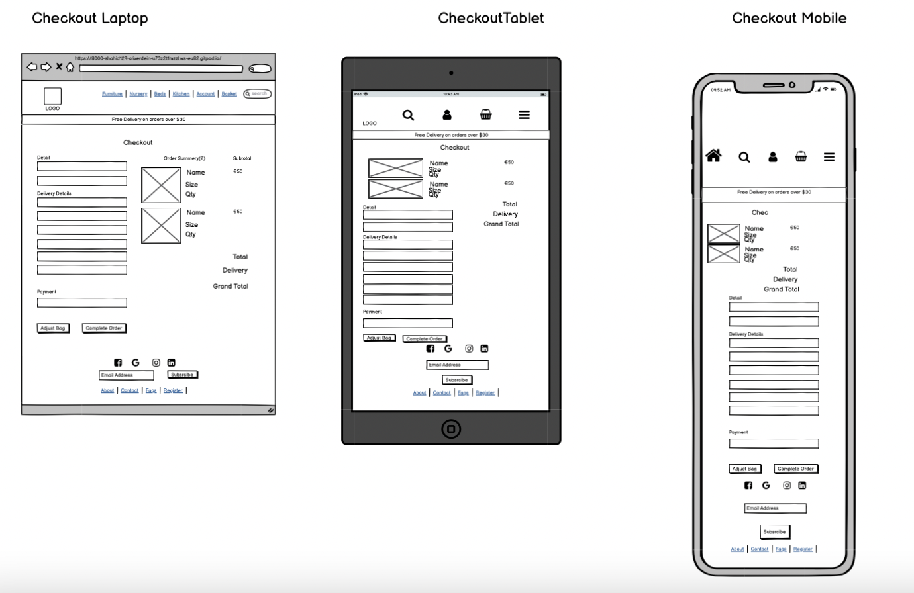
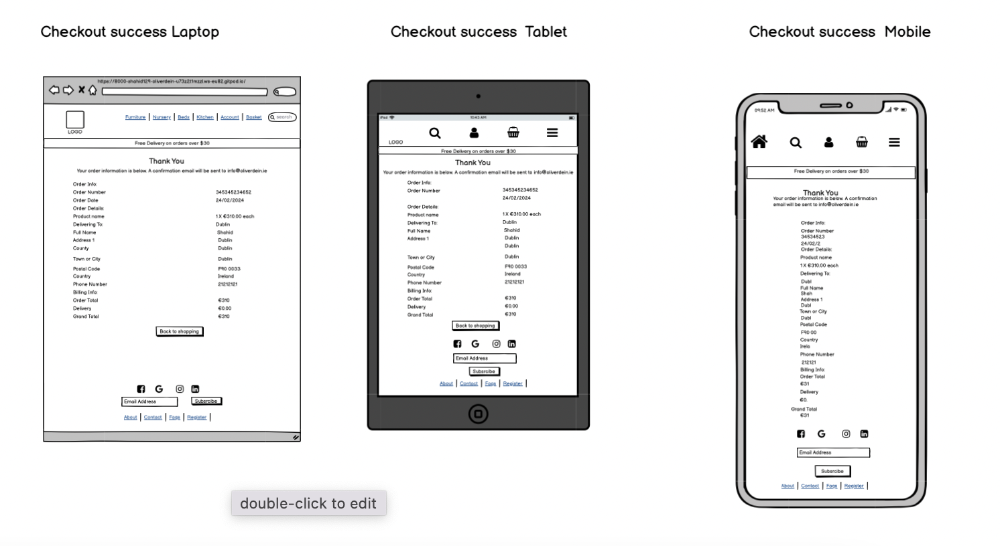
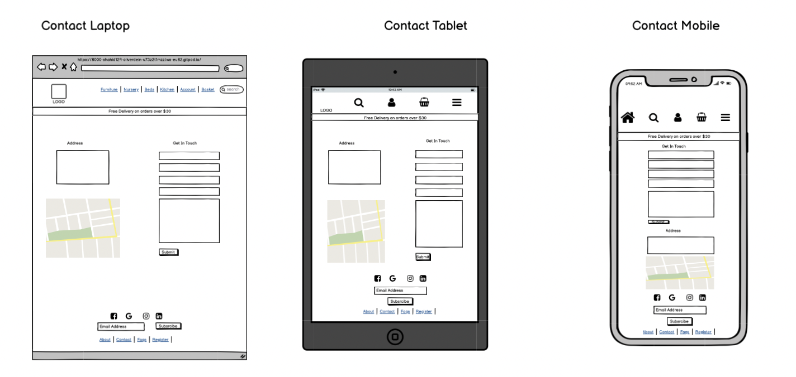
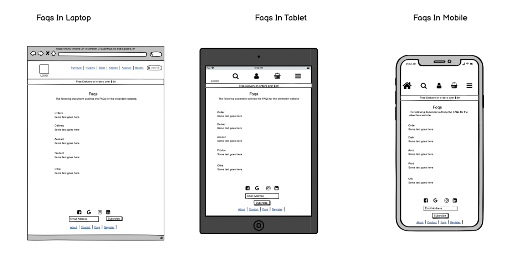

# Oliver Dein

Oliver Dein is an internet store where customers may purchase any kind of household goods. The website utilises Stripe as the payment processor.
This example project was not created to simulate actual credit card transactions. Use the test card number 4242 4242 4242 4242 with any future expiration date, any three-digit CVC, and any five-digit zip code to test the functionality.

[View Live Project Here](https://oliver-dein.herokuapp.com/)

## TABLE OF CONTENTS
- [Business Strategy](#business-strategy)
    - [Site Goals](#site-goals)
    - [Web Marketing](#web-marketing)
    - [Search Engine Optimaisation](#search-engine-optimisation)
- [Planning](#planning)
    - [User Story](#user-story)
        - [As a site user](#as-a-site-user)
        - [As a register user](#as-a-register-user)
        - [As a shopper user](#as-a-shopper-user)
        - [As a store owner](#as-a-store-owner)
    - [Design](#design)
        - [Wireframes](#wireframes)
        - [Color Schema](#color-schema)
        - [Model Schema](#model-schema)
- [Features](#features)
    - [Existing Features](#existing-features)
        - [Navigation](#navigation)
        - [footer](#footer)
        - [Introduction](#introduction)
        - [Products Page](#products-page)
        - [Product Details Page](#product-details)
        - [Bag Page](#bag-page)
        - [Checkout Page](#checkout-page)
        - [Checkout Success Page](#checkout-success-page)
        - [Profile Page](#profile-page)
        - [FAQS Page](#faqs-page)
        - [Search Page](#search-page)
    - [Future Features](#future-features)
- [Testing](#testing)

- [Technology](#technology)
    - [Language Used](#language-used)
    - [Database Used](#databse-used)
    - [Frameworks Used](#frameworks-used)
    - [Libraries Used](#libraries-used)
    - [Stripe](#stripe)
- [Deployment](#deployment) 
- [Credits](#credits)
    - [Code](#code)
    - [Media](#media)
    - [Others](#others)
- [Acknowledgement](#acknowledgement)

## Site Goals
- Site owners aim
    - Site owners can easily sell their products.
    - Site owners add or update their products.
    - Site owners can promote their products in sale or fetured products category.
-  Site Users Goals:
    - Can easily find the products.
    - Get a decent user experience.
    - Can purchase proudcts easily.

## Web Marketing
The use of social media marketing is probably essential for drawing customers and increasing visibility. The best way to generate interest is probably through an organic approach as the marketing budget will probably be little at first.

Marketing on social media platforms other than Facebook, such as Instagram, Pinterest, and YouTube, is advantageous. Because Facebook marketing is more important than any other platform, I will use it for the purposes of this project. 
The live face book page can be found [here](https://www.facebook.com/profile.php?id=100089334735487). If the site is no longer available an image can be found [here](docs/screenshot/FB_page_1.png) and [here](docs/screenshot/FB_page_2.png).

## Search Engine Optimaisation
The meta keywords and description in the site's base.html have been updated to reflect the researches keywords. On significant pages like the index and product pages, the site title has the name Oliver Dein and also contains key keywords.

The homepage has also been designed with SEO in mind. Some of the keywords are also used in the text portions of the webpage, with strong tags surrounding the significant ones. For SEO purposes, a sitemap.xml and robots.txt file have also been added.

# Planning
## User Story
The plan for this project was carried out using the Agile Methodology in Github. User Stories were created using the issues on the git hub. Each user story explicitly explains the purpose of the issues. Each user story is segmented into acceptance criteria and tasks. It was prioritised using GitHub labels with different colors. Once the issues are created they are moved to the User Stories kanban board. The Kanban board has three main columns, To Do, In Progress and Done. Once you start working with the user story, you move it to the To Do column and when finished move it to the Done column. Following this pattern of work gives you a full-on idea about the progress of the project.

The epics were created using the milistones on github. Each epic was created and related issues were added to it. A time frame was added to make sure the tasks were done on time.

- ### As a site user
    - I can rapidly understand what the website is offering so that I can determine whether it satisfies my needs.
    - I can browse frequently asked questions to find solutions to my concerns.
    - I can subscribe to a newsletter to receive updates on new goods and deals.
    - I can fill in a contact form so that I can send my query to the store owner.
    - I can view list of featured products.
    - I can get notified about when I click or do something on the website.
    - I can view the details of individual products.
    - I can quickly sign up for an account so that I can have a personal account to store my data.

- ### As a register user

    - I can easily login or logout of my account.
    - I can receive a confirmation email after registering.
    - I can keep track of my order history.
    - I can receive a confirmation email after purchasing
    - I can store my delivery information in my profile so I can check out quickly in the future.
    - I can add reviews to products, so that others and store oweners know what I think about the products.

- ### As a shopper user 
    - I can view all the products.
    - I can sort or filter out the products
    - I can view the product details so that I know what I am purchasing
    - I can view the featured or special products in the store.
    - I can add reviews to the products
    - I can easily search for products so that i know which product I am looking at.
    - I can also see number of products in any particular search.
    - I can easily checkout without need to register.
    - I can get a notification if my purchase was successfull.
    - I can receive a confirmation email after purchasing
    I can view an order confirmation after checkout so that I can ensure that the purchase is as expected.
    - I can create an account and store my purchase history and my details for future purchase.
    - I can get an email confirmation for sending a message through contact form

- ## As a store owner
    - I can add a product so that I can add new items to my store.
    - I can edit a product so that I can change the information about the product.
    - I can delete a product so that I can remove those items that are no longer available.
    - I can add featured items to my store
    - I can display recently added items to my store.
    - I can post questions to the frequently asked questions part of my website so that I can address frequently requested questions from my customers.
    - I can edit my faqs if I need to change it.
    - I can delete my faqs that are no longer needed.
    - I can view the messages from contact us form in the admin panel
    

## Design
The website is created to draw users' attention and be easy to use, making it possible for an user to browse and buy things of interest quickly. In order to plan the site's layout, wireframes for desktop, tablet, and mobile views were made and only few colors were used to maintain consistency of the website.

- ## Wireframes
wireframes for the project were created using [Balsamiq](https://balsamiq.com/)

- Home Page 

    

- Product Page

    Product page displays all the products available in the store.

- Product Details Page

    Displays the details of the product. Users can add products to their bag. They can also +/- the amount of products and update the bag from here

- Register Page

    Users can register on this page, If they are already registered, the page gives them a link to the sign in page
    

- Sign In

    Users can sign in on this page, If they are not registered, the page gives them a link to the register page/
    

- Shopping Bag

    Users can add items to their shopping bag. This page gives them to +/- their products as well as to delete them.
    

- Checkout Page

    Users can enter their shipping and bank details to make a purchase. To save their details for future use, they need to create and account
    

- Checkout Success Page

    Once the checkout is complete, the user is redirected to checkout success page, where they can see their order details and shipping details.
    

- Contact Page

    Users can view company details and they can fill up the form contact us.
    

- Faqs Page

    Users can find frequently asked questions
    

