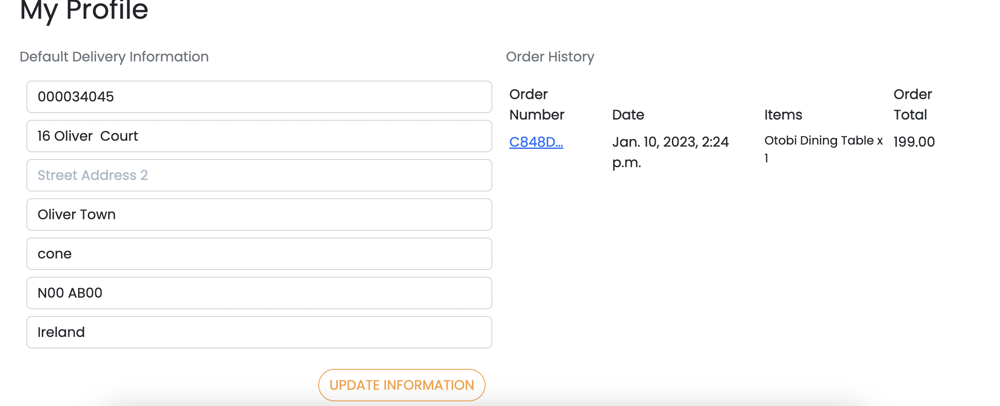

# Oliver Dein

Oliver Dein is an internet store where customers may purchase any kind of household goods. The website utilises Stripe as the payment processor.
This example project was not created to simulate actual credit card transactions. Use the test card number 4242 4242 4242 4242 with any future expiration date, any three-digit CVC, and any five-digit zip code to test the functionality.

[View Live Project Here](https://oliver-dein.herokuapp.com/)

## TABLE OF CONTENTS
- [Business Strategy](#business-strategy)
    - [Site Goals](#site-goals)
    - [Web Marketing](#web-marketing)
    - [Search Engine Optimaisation](#search-engine-optimisation)
- [Planning](#planning)
    - [User Story](#user-story)
        - [As a site user](#as-a-site-user)
        - [As a register user](#as-a-register-user)
        - [As a shopper user](#as-a-shopper-user)
        - [As a store owner](#as-a-store-owner)
    - [Design](#design)
        - [Wireframes](#wireframes)
        - [Color Schema](#color-schema)
        - [Model Schema](#model-schema)
- [Features](#features)
    - [Existing Features](#existing-features)
        - [Navigation](#navigation)
        - [footer](#footer)
        - [Home Page](#home-page)
        - [Products Page](#products-page)
        - [Product Details Page](#product-details-page)
        - [Bag Page](#bag-page)
        - [Checkout Page](#checkout-page)
        - [Checkout Success Page](#checkout-success-page)
        - [Profile Page](#profile-page)
        - [FAQS Page](#faqs-page)
        - [Contact Page](#contact-page)
        - [Search Page](#search-page)
        - [Error 404 Page](#error-404-page)
        - [Forgot Password](#forgot-password)
    - [Future Features](#future-features)
- [Testing](#testing)

- [Technology](#technology)
    - [Language Used](#language-used)
    - [Frameworks Used](#frameworks-used)
    - [Libraries Used](#libraries-used)
    - [Database Used](#databse-used)
    - [Stripe](#stripe)
- [Deployment](#deployment) 
- [Credits](#credits)
    - [Code](#code)
    - [Media](#media)
    - [Others](#others)
- [Acknowledgement](#acknowledgement)

## Site Goals
- Site owners aim
    - Site owners can easily sell their products.
    - Site owners add or update their products.
    - Site owners can promote their products in sale or fetured products category.
-  Site Users Goals:
    - Can easily find the products.
    - Get a decent user experience.
    - Can purchase proudcts easily.

## Web Marketing
The use of social media marketing is probably essential for drawing customers and increasing visibility. The best way to generate interest is probably through an organic approach as the marketing budget will probably be little at first.

Marketing on social media platforms other than Facebook, such as Instagram, Pinterest, and YouTube, is advantageous. Because Facebook marketing is more important than any other platform, I will use it for the purposes of this project. 
The live face book page can be found [here](https://www.facebook.com/profile.php?id=100089334735487). If the site is no longer available an image can be found [here](docs/screenshot/FB_page_1.png) and [here](docs/screenshot/FB_page_2.png).

## Search Engine Optimaisation
The meta keywords and description in the site's base.html have been updated to reflect the researches keywords. On significant pages like the index and product pages, the site title has the name Oliver Dein and also contains key keywords.

The homepage has also been designed with SEO in mind. Some of the keywords are also used in the text portions of the webpage, with strong tags surrounding the significant ones. For SEO purposes, a sitemap.xml and robots.txt file have also been added.

# Planning
## User Story
The plan for this project was carried out using the Agile Methodology in Github. User Stories were created using the issues on the git hub. Each user story explicitly explains the purpose of the issues. Each user story is segmented into acceptance criteria and tasks. It was prioritised using GitHub labels with different colors. Once the issues are created they are moved to the User Stories kanban board. The Kanban board has three main columns, To Do, In Progress and Done. Once you start working with the user story, you move it to the To Do column and when finished move it to the Done column. Following this pattern of work gives you a full-on idea about the progress of the project.

The epics were created using the milestones on github. Each epic was created and related issues were added to it. A time frame was added to make sure the tasks were done on time.

- ### As a site user
    - I can rapidly understand what the website is offering so that I can determine whether it satisfies my needs.
    - I can browse frequently asked questions to find solutions to my concerns.
    - I can subscribe to a newsletter to receive updates on new goods and deals.
    - I can fill in a contact form so that I can send my query to the store owner.
    - I can view list of featured products.
    - I can get notified about when I click or do something on the website.
    - I can view the details of individual products.
    - I can quickly sign up for an account so that I can have a personal account to store my data.

- ### As a register user

    - I can easily login or logout of my account.
    - I can receive a confirmation email after registering.
    - I can keep track of my order history.
    - I can receive a confirmation email after purchasing
    - I can store my delivery information in my profile so I can check out quickly in the future.
    - I can add reviews to products, so that others and store oweners know what I think about the products.

- ### As a shopper user 
    - I can view all the products.
    - I can sort or filter out the products
    - I can view the product details so that I know what I am purchasing
    - I can view the featured or special products in the store.
    - I can add reviews to the products
    - I can easily search for products so that i know which product I am looking at.
    - I can also see number of products in any particular search.
    - I can easily checkout without need to register.
    - I can get a notification if my purchase was successfull.
    - I can receive a confirmation email after purchasing
    I can view an order confirmation after checkout so that I can ensure that the purchase is as expected.
    - I can create an account and store my purchase history and my details for future purchase.
    - I can get an email confirmation for sending a message through contact form

- ## As a store owner
    - I can add a product so that I can add new items to my store.
    - I can edit a product so that I can change the information about the product.
    - I can delete a product so that I can remove those items that are no longer available.
    - I can add featured items to my store
    - I can display recently added items to my store.
    - I can post questions to the frequently asked questions part of my website so that I can address frequently requested questions from my customers.
    - I can edit my faqs if I need to change it.
    - I can delete my faqs that are no longer needed.
    - I can view the messages from contact us form in the admin panel
    

## Design
The website is created to draw users' attention and be easy to use, making it possible for an user to browse and buy things of interest quickly. In order to plan the site's layout, wireframes for desktop, tablet, and mobile views were made and only few colors were used to maintain consistency of the website.

- ## Wireframes
wireframes for the project were created using [Balsamiq](https://balsamiq.com/)

- Home Page 

    

- Product Page

    Product page displays all the products available in the store.

- Product Details Page

    Displays the details of the product. Users can add products to their bag. They can also +/- the amount of products and update the bag from here

- Register Page

    Users can register on this page, If they are already registered, the page gives them a link to the sign in page
    

- Sign In

    Users can sign in on this page, If they are not registered, the page gives them a link to the register page/
    

- Shopping Bag

    Users can add items to their shopping bag. This page gives them to +/- their products as well as to delete them.
    

- Checkout Page

    Users can enter their shipping and bank details to make a purchase. To save their details for future use, they need to create and account
    

- Checkout Success Page

    Once the checkout is complete, the user is redirected to checkout success page, where they can see their order details and shipping details.
    

- Contact Page

    Users can view company details and they can fill up the form contact us.
    

- Faqs Page

    Users can find frequently asked questions
    

- ## Color Schema

The color palette for this project was kept as simple as possible in order to maintain the contrast between the background and the foreground.

- ## Model Schema

Two relational databases were used to create the site. The built in Django SQLite database was used for development and then Postgres for the deployed version. The site is based around a number of models separated into the following main groups.

**Product Models**

**Category** - stores the details of a product category.

- **Product** - stores all the details about a product for sale. Connected to the featured product, recently added products and Category objects via foreign key relationships.

- **Review / Comments** - stores a user review of a product and is connected to the Product and by foreign key relationships.

**User Models**

- **User** - the Django Allauth user model containing information such as username and password.

- **Profile** - stores a users default delivery information and is connected to the User via a one to one relationship.

**Order Models**
- **Order** - a foreign key relationship connects the user profile to the storage of the complete order data.

- **OrderLineItem** - stores the product information for a single product purchased on an order. Foreign key relationships connect the product and order.

Two additional models providing general information for the site user or store owner have also been used.

- **Contact** - stores a site user message submitted through the contact form.
- **FAQ** - stores FAQ questions and answers that the store owner has added to the site.

    

    

    

    

# Features
### Existing Features

### Navigation
- The navigation bar, which can be found on all pages, enables users to quickly access the site's key pages without having to use their browser's navigation buttons.
- The navbar uses a hamburger menu toggle on smaller displays and is fully responsive.
- The user is immediately informed whether they are logged in or not by the My Account dropdown's several options, which vary depending on the user status. It also has additional choices that are solely available to store owners.
- only logged in users can access the profile or logout pages.
- only not logged in users can access login and register page
- The menu collapses to a toggler on smaller screens whilst leaving the account, search and basket and burger menu links in the navbar allowing for easy navigation across all devices.
- Navigation on large screen
    

- Navigation on smaller screen
    

### Footer
- Links to the store's social media pages are provided in the footer, providing more methods to interact with the store. The footer is available on all pages of the website.
- The footer also provides navigation to all the important parts of the site including the Contact, FAQ page and privacy.

### Home Page
The home page is divided into different sections.

- A hero image with a link to the all products page and some text content to boost SEO 

- The Featured Products section displays the most recently added eight featured products. Only the admin has access to select which products will be added as featured products.

- The Recently Added Products section displays the most recently added eight products. 

- This section displays bootstrap carosel reviews. It shows the product image, followed by who reviewed it and the review description.

### Products Page
- The all products page displays all the products available on the website. The user has the option to sort the products into different categories. Once they click on the product, it brings them to the product details page.

- A sale tag is added automatically if product is on sale along with the original price

- It also shows the reviews on each product which helps the user to understand the quality of the products they are looking at.

- Additional Edit, Delete and Update options are displayed on this page when the superuser is logged in.

### Product Details Page

- The product detail page provides additional information about the products

- The user can choose the quantity of the product they wish to purchase

- A review form is displayed in the review section for registered users to leave a review.

- Review of the product is displayed if there is a review available on that product.

    

### Bag Page

- The bag page provides a summary of the items in the basket and their total prices.
- It calculates prices of items automatically if an item is on sale.
- The user may easily make their final purchasing decisions because they have the opportunity to update or remove goods from the basket.
- If the user wants to delete an item from the basket, they are asked if they really want to delete the item from the basket. This is to ensure that removing an item from the bag was not done mistakenly.

    

### Checkout Page
- It is possible to purchase from the store as a guest or registered user.
- Only registered users can save their info for future purchase.
- The checkout page is simple which makes it easier for a user to make purchase.
- It also shows the summery of the products so that the user knows what they are purchasing before making the payment.
- The page gives the buyer an option to create an account if they wish to save their details for future

    

### Checkout Success Page
- Once the order has been processed, a checkout success page is loaded to let the customer know whether or not their purchase was successful.

- An email of the order confirmation is also sent to the user.

    

### Profile Page

- A registered user can easily access their order history and modify their default shipping information on their profile page.

- User can also update their information

    

### FAQS Page
- The FAQ page displays FAQs so that the user can easily find an answer.
- Through the  FAQ page, the store owner can quickly add a question and its answer, and it will be shown for site visitors straight immediately.
- Store owners can edit, update and delete a faqs if the wish to.

    

### Contact Page
- The Contact page displays the virtual address of the store and its location on the map.

- It also gives users the option to send a quick message about their queries.
- The admin can view the message in the admin panel. 
- At the minute the admin does not have option to reply back to the message but that can be added in the future feature

    

### Search Page

- The search page searches for the products and displays on the page.
- It also displays the total number of matches that were found in the search results

    

### Error 404 Page

- A  custom 404 error page that gives the user a polite message.
- It also gives the user to head back to the home page with a link.

    

### Forgot Password

- If a user has forgotten their password they will be asked to enter their email, and oliverdein.ie will send them an email with a link to reset their password.
- User will be asked to enter their password twice for confirmation.

- password reset form

    

- email received to reset password

    

## Future Features
- Site owner or admin can respond to a message
- Added inventory count and displays out of stock if the item is not available.
- A dedicated order tracking page with orders potentially linked to multiple shipping models allows site visitors to monitor the creation, processing, and shipment of orders.
- A 'Favorite' button where Customers can save it to their favorites and use it later. 
- Implement Social login where users can log in using social media login, such facebook, instagram, google.

# Testing 
Please refer to [TESTING](TESTING.md) file for all testing performed

# Technology

## Language Used
- [HTML5](https://en.wikipedia.org/wiki/HTML5)
- [CSS3](https://en.wikipedia.org/wiki/CSS)
- [JavaScript](https://en.wikipedia.org/wiki/JavaScript)
- [Python](https://en.wikipedia.org/wiki/Python_(programming_language))

## Frameworks Used
- [Django](https://www.djangoproject.com/) - A high-level Python web framework that encourages rapid development and clean, pragmatic design.

- [Bootstrap](https://getbootstrap.com/) - A framework for building responsive, mobile-first sites.

# Libraries Used
- [Django Allauth](https://django-allauth.readthedocs.io/en/latest/index.html) - is used for user authentication, registration & account management to the site.
- [Django Crispy Forms](https://django-crispy-forms.readthedocs.io/en/latest/) - is used to add bootstrap styling to the forms used.
- [Django Countries](https://pypi.org/project/django-countries/) - is used for the country CountryField in the checkout page.
- [jQuery](https://jquery.com/) - is used for styling components and also in some of the custom JS used throughout the site.
- [Google Fonts](https://fonts.google.com/) - is used for websites font
- [Font Awesome](https://fontawesome.com/) - is used for all the icons on the site.
- [Image Compressor](https://imagecompressor.com/) - is used to compress images
- [Mailchimp](https://mailchimp.com/) - is used to create the newsletter signup form.
- [Facebook Pages](https://www.facebook.com/)
- [Stripe](https://stripe.com/gb) - is used for the processing of payments.
- [Heroku](https://dashboard.heroku.com/apps) - is used to deploy the site.
- [Gunicorn](https://gunicorn.org/) - is used as the server to run Django on Heroku.
- [Amazon AWS](https://aws.amazon.com/) - is used store the static and media files for the site.
- [PostgresSQL](https://www.postgresql.org/) - is used as the database for the site.
- [Git](https://git-scm.com/) - is used as version control 
- [Github](https://github.com/) - is used to store the project's code.
- [pillow](https://pypi.org/project/Pillow/) - Python imaging library
- [psycopg2](https://pypi.org/project/psycopg2/) - database adapter which allow us to connect with a postgres database
- [boto3](https://pypi.org/project/boto3/) - Allows connection to AWS S3 bucket

## Database Used
sqlite3 is used for development.

[ElephantSQL](https://www.elephantsql.com/) for deployment to heroku.

## Stripe
[Stripe](https://stripe.com/gb) has been used for the payment for this website.

The developer mode in Stripe allows us to use and process test payments.

Type | card No | Expiry | CVC | ZIP
--- | --- | --- | --- | ---
Success | **4242 4242 4242 4242** | A date in the future | Any 3 digits| Any 3 digits
Require authorisation | **4000 0027 6000 3184** | A date in the future | Any 3 digits| Any 5 digits

## Deployment

The project has been deployed to Heroku. Detail of the steps taken to deploy the project can be found [here](DEPLOYMENT.md)

# Credits

## Code
- The Code Institute **Boutique Ado** walkthrough project provided a lot of the site's original functionality, which was then modified and expanded as needed.
- The code institute  **I Think Therefore I Blog** walkthrough were also consulted whenever needed.

## Media

- The images for this project was taken from [Unsplash](https://unsplash.com/)

- The Favicon for this project was made from [Favicon](https://favicon.io/favicon-generator/)

- The Icon for this project was taken from [Font Awesome](https://fontawesome.com/)

- The Font for this project was taken from [Google Fonts](https://fonts.google.com/)

- Image was compressed by [compressor](https://compressor.io/)

## Others
- To better understand the code and a lot of help was taken from

    - [Django documents](https://docs.djangoproject.com/en/4.1/)
    - [Stack Overflow](https://stackoverflow.com/)
    - [GeeksforGeeks](https://www.geeksforgeeks.org/)
    - [Medium](https://medium.com/all-about-django)

# Acknowledgement

I want to express my gratitude to my tutor Kasia, and my mentor Ronan, for their continual support and advice. The Jan-2022-lwetb slack group and all of the other slackers in the code institute

Thank You
I want to especially thank my mentor Ronan for all of his crucial advice and assistance throughout the course of this project's development. I want to express my gratitude to my wife in particular for providing me infinite time to finish the projects and the course.